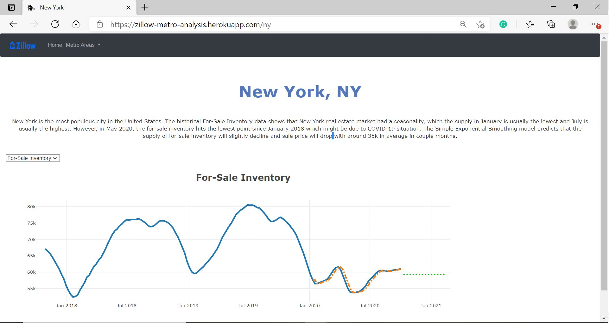

<!-- PROJECT LOGO -->
<br />
<p align="center">
  <a href="https://zillow-metro-analysis.herokuapp.com/">
    
  </a>
  <h3 align="center">Housing Analysis and Forecasting in Top 5 Metro Areas in the U.S.</h3>
  <p align="center">
    <a href="https://zillow-metro-analysis.herokuapp.com/"><strong>Explore the Website »</strong></a>
  </p>
</p>

## About The Project
<a href="https://taiwan-hotel.herokuapp.com/">
  
</a>
<br>
<strong><i> The website is to analyze Taiwan hotel market and to visualize data on a monthly basis for hoteliers to review competitors performance, pricing, and seasonality from macro and micro prospectives, and for potential investors to receive basic information of current market trend in hotel industry. </i></strong>

## Prerequisites 
* Getting Started 
  ```
  git clone https://github.com/emmayianpan/Taiwan_Hotel.git
  ```
* Get [API Key at Mapbox](https://docs.mapbox.com/api/overview/) and input the token into static/js/map.js 
  ```
  accessToken: "YOUR API KEY"
  ```
  
## Built With
* [Python Pandas](https://pandas.pydata.org/) 
* [Python SQLAlchemy](https://www.sqlalchemy.org/) 
* [PostgreSQL](https://www.postgresql.org/) 
* [JavaScript Plotly](https://plotly.com/javascript/) 
* [JavaScript Leaflet](https://leafletjs.com/)
* [HTML](https://www.w3schools.com/html/)
* [CSS](https://www.w3schools.com/css/)
* [Python Flask](https://flask.palletsprojects.com/en/1.1.x/) 
* [Heroku](https://www.heroku.com/)

## Data Sources
* [Taiwan Hotels Database](https://taiwanstay.net.tw/) - The website, which is operated under Tourism Bureau, Ministry of Transportation and Communications provides month-end overall performace of Taiwan hotels. The reports can be download as PDF or ODF files.

## ETL Process
* Pull raw data from [Taiwan Hotels Database](https://taiwanstay.net.tw/) and downloaded reports as ODF files. Organized raw data for the first step.
* Transfered into csv files, cleaned/sorted data with correct formatting and created new columns by calculation including RevPAR, Demand, etc. to complete data processing.
* Loaded data onto PostgreSQL and merged monthly data.
* Created another dataset for area performance by using combined data to calculate on Jupyter Notebook. 
* Manually input data "Hotle English Name", "Address", "Longtitude", "Latitude" and "Website" from Google for Hotel Map.
* Exported all data into csv files while the ETL processing was completed.

## Data Visualization 
The website is presented with the visulization of: 
* Taiwan Hotel Market Overall Performance 
* Taiwan Hotel Area Performance
* Taiwan Hotel Individual Performance
* Hotel Location and Information 

## Created by 
Yi An Pan (Emma)
* [Linkedin](https://www.linkedin.com/in/emmayianpan/) 
* [GitHub](https://github.com/emmayianpan)

## 
The website template was designed by [baotm](https://github.com/baotm/admindek)
